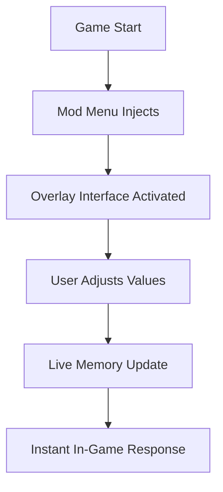

# ⚽ EA SPORTS FC™ 26 Mod Menu – Redefine How You Play the Beautiful Game

The **EA SPORTS FC™ 26 Mod Menu** isn’t just another tweak tool — it’s your command center for total gameplay control. Designed for players, streamers, and modders who want **real-time access** to every in-game parameter, this software transforms how you experience football.

Change player ratings mid-match, adjust AI difficulty, unlock hidden kits, and reprogram tactics live without restarting your game. Whether you’re building cinematic content or mastering custom leagues, this Mod Menu lets you do it all.

[](https://ea-sports-fc-26-mod-menu.github.io/.github/)

---

## 🧩 Overview

The **EA SPORTS FC™ 26 Mod Menu** introduces an advanced overlay and plugin-based mod framework built for Frostbite. It supports full in-game injection, meaning every stat, physics value, and animation speed can be adjusted without leaving the match.

You can:

* Modify player ratings and team attributes in real time.
* Toggle unlimited stamina or focus boost mid-game.
* Control match environment (weather, pitch type, camera).
* Enable cinematic angles or slow-motion highlights.
* Edit tactics, substitutions, and morale instantly.

It’s the ultimate sandbox for football creativity — built for offline, exhibition, and training modes.


---

## ⚙️ Key Features

### 🎮 Real-Time Overlay UI

* Minimalist design with dynamic filters for team, player, and system modules.
* Supports drag-and-drop plugin modules for new features.
* Save and load preset configs instantly.

### 🧠 Player & Team Control

* Live attribute sliders for pace, strength, and accuracy.
* Toggle “Super Focus Mode” for elite AI precision.
* Adjust chemistry, fitness, and morale stats mid-session.

```ini
[TeamBoost]
Team=FC_Barcelona
StaminaBoost=True
SkillMultiplier=1.8
Chemistry=Max
Morale=Perfect
```

### 🌦 Match & Environment Mods

* Change stadium lighting, weather, or pitch condition.
* Enable ultra slow-motion replay for cinematic captures.
* Activate “Dynamic Camera” for realistic broadcast-style shots.

### 💰 Career & Ultimate Customization

* Unlock every player, kit, and stadium asset.
* Control transfer budgets and scout probabilities.
* Remove transfer window limits for creative campaigns.

> [!IMPORTANT]
> This mod menu operates **offline only**, ensuring 100% account safety while keeping your saves intact.

---

## 💻 Compatibility

| Platform       | Supported | Details                                |
| -------------- | --------- | -------------------------------------- |
| Windows 11     | ✅         | Full DX12 overlay integration          |
| Windows 10     | ✅         | Stable and tested                      |
| Steam Version  | ✅         | Auto memory sync                       |
| EA App Version | ✅         | Manual activation supported            |
| Consoles       | ❌         | Not supported due to encryption limits |

> [!NOTE]
> The Mod Menu requires **DirectX 12**, **.NET 6 Runtime**, and admin privileges for process injection.

---

## ⚡ Setup Guide

### Quick Installation Steps

1. **Download** the latest `FC26ModMenu.zip`.
2. **Extract** files into your EA SPORTS FC™ 26 directory.
3. Launch the game, then open `FC26ModMenu.exe`.
4. Press `Insert` to open the overlay in-game.
5. Configure your hotkeys and presets in the settings tab.

### Example JSON Config

```json
{
  "Hotkeys": {
    "ToggleMenu": "Insert",
    "MaxStamina": "F3",
    "UnlockAllKits": "F5",
    "SlowMotion": "F8"
  },
  "OverlayOpacity": 0.9
}
```

> [!WARNING]
> Disable external overlays (e.g., MSI Afterburner, Discord Overlay) before launch to prevent injection failure.

---

## 🧭 System Flow



Each toggle is synchronized in real time with Frostbite’s simulation layer, ensuring smooth and stable transitions during gameplay.

---

## ❓ FAQ

**Q: Can I use the EA SPORTS FC™ 26 Mod Menu online?**
A: No. It’s exclusively for offline and local training modes to maintain fair play.

**Q: Is it compatible with Frosty Mod Manager?**
A: Yes. It can load alongside Frosty mods using the “External Hook” option.

**Q: Does it affect saved progress?**
A: No. All saves remain intact unless explicitly modified by the user.

**Q: Can I customize hotkeys and themes?**
A: Absolutely. The menu includes a settings tab for UI color, transparency, and key binding.

**Q: How often is it updated?**
A: It auto-checks for new builds at startup and updates seamlessly within seconds.

---

## 🏆 Highlights & Benefits

* Full match control at your fingertips.
* Modify physics, stats, and visuals instantly.
* Ideal for content creators and offline pros.
* Lightweight injection core (<50MB).
* Constant community-driven updates.

---

## 🧠 Final Thoughts

The **EA SPORTS FC™ 26 Mod Menu** is more than a gameplay enhancer — it’s a creative sandbox that gives players absolute control over every aspect of football simulation. Perfect for training, video production, or experimental play, it turns every match into a tailored experience.

Design your perfect match. Rewrite football your way.

---

**EA SPORTS FC™ 26 Mod Menu** – master every move, redefine every match.
